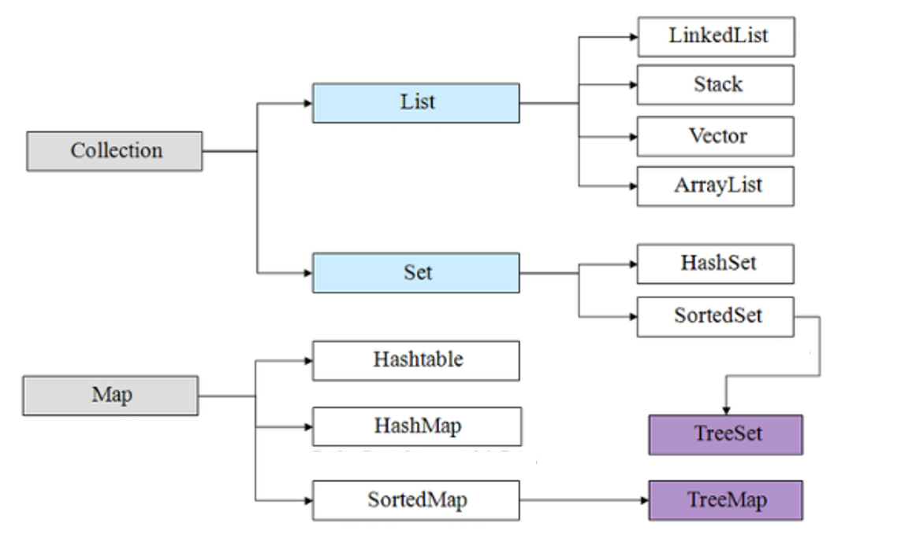

## Collections

Collections란 데이터의 집합, 그룹을 의미한다.

JFC(Java Collection Framework)는 자료구조인 컬렉션과 이를 구현하는 클래스를 정의하는 인터페이스를 제공한다.

### 1. Java Collections Framework 상속 구조

JFC에서는 [Collection](#2. Collection)과 [Map](#3. Map)을 제공하고 있다.



### 2. Collection

Collection은 [List](#2.1 List)와 [Set](#2.2 Set)으로 나누어진다.

#### 2.1 List

순서가 있고 중복을 허용하는 저장 공간으로 [ArrayList](#2.1.1 ArrayList), [LinkedList](#2.1.2 LinkedList), [Vector](#2.1.3 Vector), [Stack](#2.1.4 Stack)이 있다.

##### 2.1.1 ArrayList

- 배열을 이용해서 리스트를 구현한 것
- 내부적으로 배열을 이용하기 때문에 인덱스를 이용해 접근하는 것이 빠름
  - 무작위 접근(Random Access)가 가능하여 조회가 빠름
- 중간 삽입, 삭제가 느림
  - 삽입, 삭제가 할 때마다 임시 배열을 작성 후 데이터를 복사하는 방식으로 작동 하기 때문 

```java
package com.jremind.exam05;

import java.util.ArrayList;
import java.util.List;

public class ArrayListExam {
	public static void main(String[] args) {
		List<String> list = new ArrayList<String>();
		
		list.add("Java");
		list.add("C++");
		list.add("Python");
		list.add("C#");
		list.add("Objective-C");
		
		int size = list.size();
		System.out.println("총 데이터 수: " + size);
		System.out.println();
		
		String item = list.get(2);
		System.out.println("인덱스 2번 항목: " + item + "\n");
		
		for(int i=0; i<list.size(); i++) {
			String str = list.get(i);
			System.out.println(i + ": " + str);
		}
		System.out.println();
		
		System.out.println();
		
		list.remove(2);
		list.remove(2);
		list.remove("c++");
		
		for(String s: list) {
			System.out.println(s);
		}
	}
}
```

##### 2.1.2 LinkedList

- 다음 값을 참조하는 노드와 현재 값으로 이루어짐
- 다음 값을 참조하는 노드만 수정하면 되기 때문에 삽입, 삭제가 빠름
- 순차 접근으로 데이터의 조회가 느림

```java
package jremind;

import java.util.LinkedList;
import java.util.List;

public class LinkedListExam {
	public static void main(String[] args) {
		List<String> list = new LinkedList<String>();
		
		list.add("Java");
		list.add("C++");
		list.add("Python");
		list.add("C#");
		list.add("Objective-C");
		
		int size = list.size();
		System.out.println("총 데이터 수: " + size);
		System.out.println();
		
		String item = list.get(2);
		System.out.println("인덱스 2번 항목: " + item + "\n");
		
		for(int i=0; i<list.size(); i++) {
			String str = list.get(i);
			System.out.println(i + ": " + str);
		}
		System.out.println();
		
		System.out.println();
		
		list.remove(2);
		list.remove(2);
		list.remove("c++");
		
		for(String s: list) {
			System.out.println(s);
		}
	}
}
```

##### 2.1.3 Vector

- 동기화 기능을 제공하여 Thread Safe 함
- 멀티 쓰레드 환경에서는 Vector를 사용하는 것이 안전
- Vector에는 객체만 저장할 수 있음
  - ex) int는 불가하기 때문에 int에 대응되는 Wrapper 클래스인 Integer를 사용

```java
package jremind;

import java.util.Vector;

public class VectorExam {
	public static void main(String[] args) {
		Vector v = new Vector();
		System.out.println("Size="+v.size()+" Capacity="+v.capacity());

		for( int i=0; i<10; i++ ) {
		    v.addElement(new Integer(i));
		}
		System.out.println("Size="+v.size()+" Capacity="+v.capacity());

		Integer a = (Integer)v.elementAt(0);
		System.out.println(a);

		v.removeElement(a);
		v.removeElement(1);
		System.out.println(v);
	}
}
```

##### 2.1.4 Stack

- 데이터 항목들이 일정한 순서로 나열된 자료구조

- 한쪽 끝에서만 새로운 항목을 삽입하거나 기존의 항목을 제거할 수 있음
  - Last In First Out(LIFO)
- Vector 클래스를 상속받아 구현됨

```java
package jremind;

import java.util.Stack;

public class StackExam{
	public static void main(String[] args) {
				Stack s = new Stack();
				s.push("A");
				s.push("B");

				System.out.println(s.empty());
				System.out.println(s.pop());
				System.out.println(s.peek());
				System.out.println(s.pop());
	}
}
```

#### 2.2 Set

순서가 없고 중복을 허용하지 않는 집합으로 [HashSet](#2.2.1 HsahSet), [TreeSet](#2.2.2 TreeSet)이 있다.

##### 2.2.1 HsahSet

- Set 인터페이스를 구현하는 대표적인 Collection 클래스
- 순서를 유지하려면, LinkedHashSet 클래스를 사용

##### 2.2.2 TreeSet

- 이진 검색 트리로 구현
- SortedSet 인터페이스의 기본 구현체
- 범위 검색과 정렬에 유리한 Collection 클래스
- HashSet보다 데이터 추가, 삭제에 시간이 더 걸림

### 3. Map

Key와 Value로 이루어진 데이터 집합으로 [Hashtable](#3.1 Hashtable), [HashMap](#3.2 HashMap), [TreeMap](#3.3 TreeMap)이 있다.

#### 3.1 Hashtable

- 동기화를 보장하는 Map 계열의 클래스
- HashMap과는 동기화의 차이가 있음

#### 3.2 HashMap

- 동기화를 보장하지 않는 Map 계열의 클래스
- 해싱 기법으로 데이터를 저장하며 데이터가 많아도 검색이 빠름
- Map 인터페이스를 구현하며 데이터를 키와 값의 쌍으로 저장
- Hashtable과는 동기화의 차이가 있음
- 순서를 유지하려면 LinkedHashMap 클래스를 사용

```java
import java.util.*;

public class HashMapEx1 {
	public static void main(String[] args) {
		// TODO Auto-generated method stub
		HashMap map = new HashMap();
		map.put("myId", "1234");
		map.put("asdf", "1111");
		map.put("asdf", "1234");
		
		Scanner s = new Scanner(System.in);
		
		while(true) {
			System.out.println("id와 passwerod를 입력해주세요");
			System.out.print("id : ");
			String id = s.nextLine().trim();
			
			System.out.print("password : ");
			String password = s.nextLine().trim();
			System.out.println();
			
			if(!map.containsKey(id)) {
				System.out.println("입력하신 id는 존재하지 않습니다. 다시 입력해주세요.");
				continue;
			}else {
				if(!(map.get(id)).equals(password)) {
					System.out.println("비밀번호가 일치하지 않슷ㅂ니다. 다시 입력해주세요.");
				}else {
					System.out.println("id와 비밀번호가 일치합니다.");
					break;
				}
			}
		}
	}
}
```

#### 3.3 TreeMap

- 범위 검색과 정렬에 유리한 Collection 클래스
- SortedMap 인터페이스의 기본 구현체
- HashMap보다 데이터 추가, 삭제에 시간이 더 걸림


> 이미지 참조: https://mainpower4309.tistory.com/17 